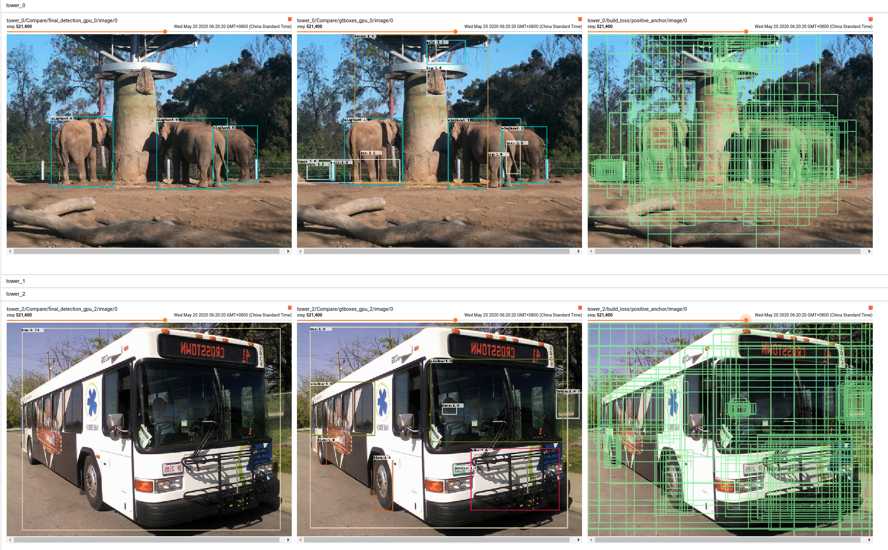
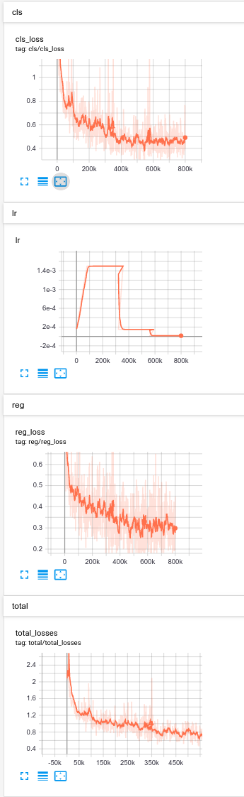
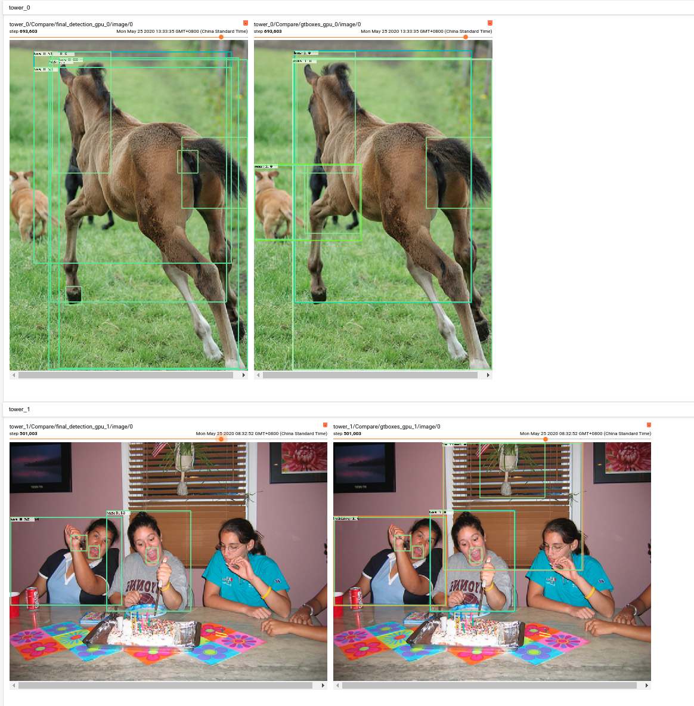
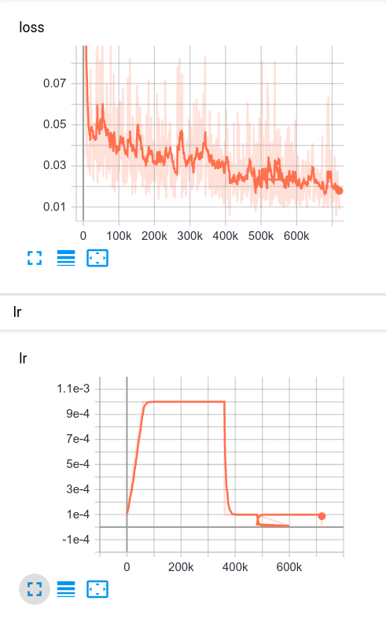

# Focal Loss and Attention mechanism for Efficient Scene Graph Generation

## Abstract
This is a tensorflow implementation of [Focal Loss and Attention mechanism for Efficient Scene Graph Generation]((https://some-web) based on RetinaNet in [Focal Loss for Dense Object Detection](https://arxiv.org/pdf/1708.02002.pdf), and it is completed by [Fuxin Duan](https://github.com/xxxxx) and Liguang Zhou(https://github.com/hszhoushen).


### Performance

- Detection network

| Model |    Backbone    |    Training data    |    Val data    |    mAP    | Inf time (fps) | model | Image/GPU | GPU | Configuration File |
|:------------:|:------------:|:------------:|:---------:|:-----------:|:----------:|:----------:|:----------:|:----------:|:----------:|
| RetinaNet | ResNet50_v1 600 | VGD(object.json) | VGD(object.json) | 21.7 | 12.5 | [model](https:xxx) | 1x | 4X GeForce RTX 1080 Ti | cfgs.py |

- SceneGraph Generation network

| Model |    Backbone    |    Training data    |    Val data    |    SGGen(R@50,R@100)    |    Predcls(R@50,R@100)    | Inf time (fps) | model | Image/GPU | GPU | Configuration File |
|:------------:|:------------:|:------------:|:---------:|:-----------:|:----------:|:----------:|:----------:|:----------:|:----------:|:----------:|
| RetinaNet | ResNet50_v1 600 | VGD(scene_graph.json) | VGD(scene_graph.json) | 13.30, 15.40 | 60.58, 78.88 | 4.5 | [model](https:xxx) | 1x | 4X GeForce RTX 1080 Ti | cfgs.py |

## My Development Environment
1、python>=3.5             
2、cuda10.0                    
3、opencv3    
4、tfplot            
5、tensorflow == 1.14      

## Download Model
### Pretrain weights
1、Please download [resnet50_v1](http://download.tensorflow.org/models/resnet_v1_50_2016_08_28.tar.gz), [resnet101_v1](http://download.tensorflow.org/models/resnet_v1_101_2016_08_28.tar.gz) pre-trained models on Imagenet, put it to data/pretrained_weights.       
2、Or you can choose to use a better backbone, refer to [gluon2TF](https://github.com/yangJirui/gluon2TF).    

### Download Dataset
1、VGD dataset related      
* [image part1](https://cs.stanford.edu/people/rak248/VG_100K_2/images.zip)
* [image part2](https://cs.stanford.edu/people/rak248/VG_100K_2/images2.zip)
* [objects.json](http://visualgenome.org/static/data/dataset/objects.json.zip)
* [scene_graphs.json](http://visualgenome.org/static/data/dataset/scene_graphs.json.zip)
* [object_alias.txt](http://visualgenome.org/static/data/dataset/object_alias.txt)
* [relationship_alias.txt](http://visualgenome.org/static/data/dataset/relationship_alias.txt)

## Compile
```  
cd $PATH_ROOT/libs/box_utils/cython_utils
python setup.py build_ext --inplace
```

## Train RetinaNet

1、If you want to train your own data, please note:  
```     
(1) Modify parameters (such as CLASS_NUM, DATASET_NAME, VERSION, etc.) in $PATH_ROOT/libs/configs/cfgs.py
(2) Add category information in $PATH_ROOT/libs/label_name_dict/lable_dict.py     
(3) Add data_name to $PATH_ROOT/data/io/read_tfrecord_batch_detection.py 
```     

2、Make tfrecord
```  
cd $PATH_ROOT/data/io/  
(Modify the original data path.)
python convert_data_to_tfrecord_detection.py
```      

3、Multi-gpu train
```  
cd $PATH_ROOT/tools
multi_gpu_train_detection.py
```

## Train SceneGraph Network

1、If you want to train your own data, please note:  
```     
(1) Modify parameters (such as CLASS_NUM, DATASET_NAME, VERSION, etc.) in $PATH_ROOT/libs/configs/cfgs.py
(2) Add category information in $PATH_ROOT/libs/label_name_dict/lable_dict.py     
(3) Add data_name to $PATH_ROOT/data/io/read_tfrecord_batch_rel.py 
```     

2、Make tfrecord
```  
cd $PATH_ROOT/data/io/  
(Modify the original data path.)
python convert_data_to_tfrecord_rel.py
```      

3、Multi-gpu train
```  
cd $PATH_ROOT/tools
multi_gpu_train.py
```

## Eval

### Detection

- inference a single image 
```
python inference_detection.py --data_dir=./demos/detection/imgs
                              --label_dir=./demos/detection/labels
                              --save_dir=./demos/detection/results
                              --GPU=0
```

- eval tfrecord image(test datasets)

```
python eval_detection.py --gpu=0 
                         --showbox
```

### SceneGraph

- inference a single image 
```
python inference_relationship.py --data_dir=./demos/scenegraph/imgs 
                                 --save_dir=./demos/scenegraph/results
                                 --GPU=0
```

- SGGEN: 
```
python eval_relationship_SGGen.py
```

- PREDCls: 
```
python eval_relationship_PREDCls.py
```

## Tensorboard
```  
cd $PATH_ROOT/output/summary
tensorboard --logdir=.
``` 

- Detection





- SceneGraph






## Reference
1、https://github.com/DetectionTeamUCAS  
2、https://github.com/endernewton/tf-faster-rcnn   
3、https://github.com/zengarden/light_head_rcnn   
4、https://github.com/tensorflow/models/tree/master/research/object_detection    
5、https://github.com/fizyr/keras-retinanet
